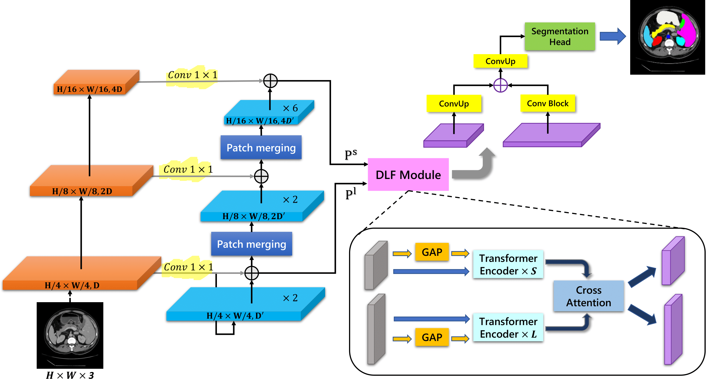
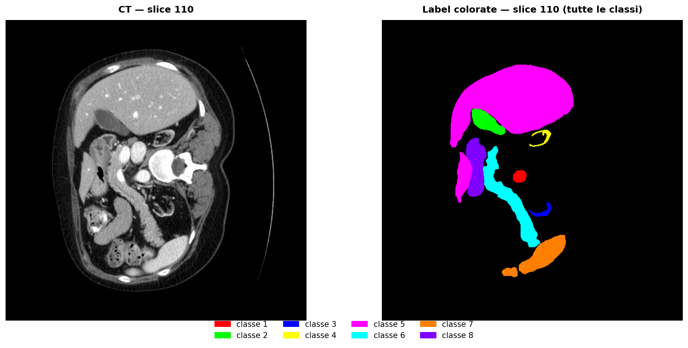
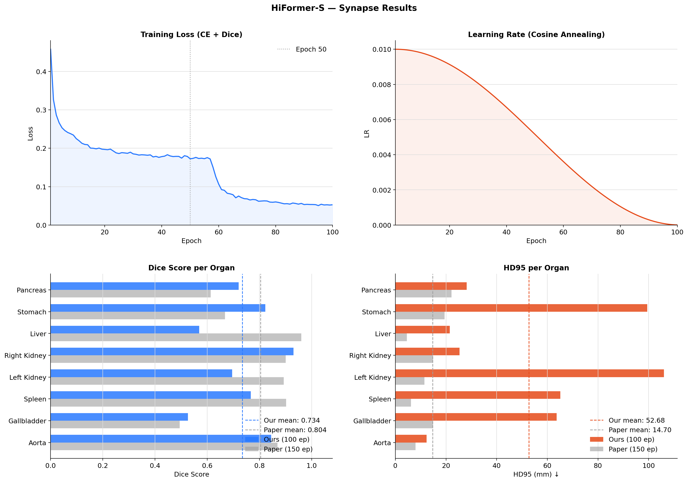

# HiFormer-S — Reimplementazione su Synapse

Reimplementazione di **HiFormer-S** per la segmentazione multi-organo su dataset CT addominale (Synapse).  
Progetto per l'esame di **Deep Learning** — Università degli Studi di Firenze, A.A. 2025/26.

> Heidari et al., *HiFormer: Hierarchical Multi-scale Representations Using Transformers for Medical Image Segmentation*, WACV 2023. [[paper]](https://arxiv.org/abs/2207.08518)

## Highlights

- Reimplementazione completa di **HiFormer-S** (WACV 2023)
- Segmentazione multi-organo su dataset **Synapse CT**
- Architettura dual-encoder: **ResNet34 + Swin Transformer**
- Fusione tramite **DLF (Double-Level Fusion)** con cross-attention
- Mean Dice: **0.704** su 8 organi
- Pipeline completamente riproducibile su **Google Colab**
---

## Architettura



HiFormer combina due encoder paralleli connessi tramite il modulo **DLF (Double-Level Fusion)**:

- **CNN encoder** — ResNet34 pretrained su ImageNet, adattato a input grayscale (1 canale)
- **Swin Transformer encoder** — Swin Tiny pretrained su ImageNet, feature multi-scala
- **DLF** — fusione dei due branch via cross-attention ai livelli 3 e 4
- **Decoder** — 4 stadi con skip connections stile U-Net

```
Input [B,1,224,224]
    ├── ResNet34 → [64,56] [128,28] [256,14] [512,7]
    ├── Swin Tiny → [96,56] [192,28] [384,14] [768,7]
    └── DLF (cross-attention) → fusione ai livelli 3 e 4
         └── Decoder → SegHead → Output [B,9,224,224]
```

---

## Dataset



Il dataset Synapse multi-organ contiene scansioni CT addominali con annotazioni su 8 organi.
- **Training**: 18 casi, 2211 slice 2D in formato `.npz`
- **Test**: 12 volumi 3D in formato `.npy.h5`

---

## Risultati



Valutazione su 12 volumi di test del dataset Synapse (8 organi + background).  
Metriche: Dice Score ↑ e HD95 in mm ↓, calcolato con voxelspacing corretto.

| Organo | Dice (ours) | Dice (paper) | HD95 ours (mm) | HD95 paper (mm) |
|---|---|---|---|---|
| Aorta | 0.8035 | 0.869 | 37.92 | 7.96 |
| Gallbladder | 0.4203 | 0.494 | 44.11 | 14.90 |
| Left Kidney | 0.8090 | 0.893 | 7.72 | 11.48 |
| Spleen | 0.7012 | 0.902 | 15.29 | 6.15 |
| Liver | 0.9389 | 0.960 | 14.11 | 4.51 |
| Stomach | 0.4554 | 0.668 | 39.44 | 19.38 |
| Right Kidney | 0.8097 | 0.900 | 19.39 | 14.90 |
| Pancreas | 0.6932 | 0.613 | 30.78 | 22.18 |
| **Mean** | **0.704** | **0.804** | **26.10** | **14.70** |

Training: 100 epoche (paper: 150). Il gap su Stomach e Gallbladder è attribuibile principalmente al minor numero di epoche. Sono gli organi anatomicamente più variabili e che beneficiano di più da training più lungo.

## Training Details

Hardware:
- GPU: NVIDIA A100 (Google Colab)
- Batch size: 8

Training:
- Epochs: 100 (paper: 150)
- Optimizer: AdamW
- Learning rate: 1e-4
- Scheduler: Cosine Annealing
- Loss: Dice + CrossEntropy

Data preprocessing:
- Input size: 224×224
- CT slice-wise training
- Data augmentation: random rotation, flip
---

## Setup

### Requisiti

```bash
pip install ml_collections medpy SimpleITK tensorboardX einops timm torch torchvision
```

### Dataset

Il dataset Synapse multi-organ è disponibile su richiesta tramite il [TransUNet repository](https://github.com/Beckschen/TransUNet).  
La struttura attesa su Google Drive:

```
MyDrive/HiFormer/
├── data/
│   └── Synapse/
│       ├── train_npz/       # 2211 slice .npz
│       └── test_vol_h5/     # 12 volumi .npy.h5
├── weights/
│   └── swin_tiny_patch4_window7_224.pth
└── results/
```

I pesi Swin Tiny pretrained vengono scaricati automaticamente alla prima esecuzione.

### Esecuzione

Apri `HiFormer_v2.ipynb` su Google Colab con GPU abilitata ed esegui le celle in ordine.  
Il notebook è strutturato in sezioni:

1. Setup ambiente e dipendenze
2. Struttura cartelle
3. Download pesi Swin pretrained
4. Configurazione modello
5. Loss e metriche
6. Decoder
7. Encoder (Swin + CNN + DLF)
8. Test encoder
9. Modello completo
10. Dataset Synapse
11. Trainer
12. Avvio training
13. Valutazione
14. Visualizzazione predizioni
15. Grafici risultati

---

## Differenze rispetto all'implementazione originale

Questa reimplementazione introduce alcune correzioni rispetto a una baseline naive:

- **HD95 con voxelspacing corretto** — calcolato in mm con spacing fisico del volume, non in pixel
- **Post-processing: largest connected component** — elimina blob spurii che fanno esplodere HD95
- **Decoder con skip al livello più fine** — il blocco finale del decoder usa lo skip da 64 canali invece di nessuno, recuperando dettaglio spaziale
- **Checkpoint con timestamp** — ogni run salva in una cartella dedicata, nessuna sovrascrittura
- **Salvataggio ogni 5 epoche** — protezione da disconnessioni Colab
- **Gestione edge case nelle metriche** — classe assente in entrambi predizione e GT → Dice=1, HD95=0

---

## Struttura del codice

Il notebook genera i seguenti moduli in `/content/hiformer_project/`:

```
hiformer_project/
├── configs/
│   └── HiFormer_configs.py     # hyperparameter centrali
├── models/
│   ├── Encoder.py              # Swin + ResNet34 + DLF
│   ├── Decoder.py              # decoder U-Net style
│   └── HiFormer.py             # modello completo + caricamento pesi
├── datasets/
│   └── dataset_synapse.py      # dataset + augmentation
├── lists/lists_Synapse/
│   ├── train.txt
│   └── test_vol.txt
├── trainer.py                  # training loop
├── evaluate.py                 # valutazione con metriche
└── utils.py                    # DiceLoss, HD95, LCC
```

---

## Riferimenti

```bibtex
@inproceedings{heidari2023hiformer,
  title     = {HiFormer: Hierarchical Multi-scale Representations Using Transformers for Medical Image Segmentation},
  author    = {Heidari, Moein and Kazerouni, Amirhossein and Soltany, Milad and Azad, Reza and Aghdam, Ehsan Khodapanah and Cohen-Adad, Julien and Merhof, Dorit},
  booktitle = {Proceedings of the IEEE/CVF Winter Conference on Applications of Computer Vision (WACV)},
  year      = {2023}
}
```
